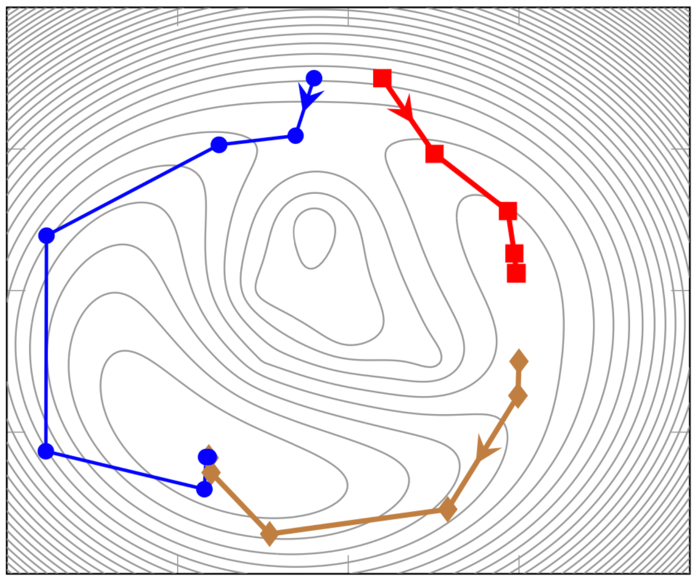
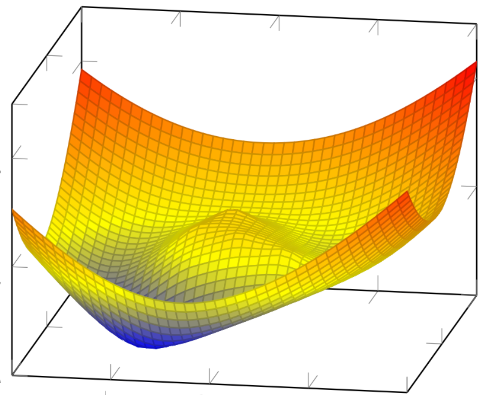

# Numerical Optimization

## Course Description
This course presents practical methods for formulating and solving linear and nonlinear numerical optimization problems that arise in science, engineering, and business applications. The course covers both unconstrained and constrained problems, with an emphasis on algorithmic descriptions. A significant component of the course involves implementing solutions, where students develop code and use state-of-the-art numerical libraries to model and solve problems in machine learning, imaging, shape design, parameter identification, classification, financial planning, PDE-constrained optimization, and other areas.

  
  

## Program Guide Description
- Solution of nonlinear equations.
- Optimality conditions for smooth optimization problems.
- Theory and algorithms for solving:
  - Unconstrained optimization
  - Linear programming
  - Quadratic programming
  - Global optimization
  - General linearly and non-linearly constrained optimization problems

## Learning Outcomes
- A working knowledge of current state-of-the-art algorithms for smooth optimization.
- The modeling skills necessary to formulate domain problems as numerical optimization problems.
- A sufficient understanding of the methods, applications, and limitations to engage with the literature effectively.

## Key Topics
- **Preliminaries**: Python, numerical linear algebra, multidimensional Taylor’s series, etc.
- **Unconstrained Optimization** 
  - Gradient methods, Newton’s method, line search, convergence analysis
  - Non-linear least squares problems, Gauss Newton methods, regularization
  - Quasi-Newton methods
- **Systems of Nonlinear Equations**: Newton methods, globalization, continuation methods 
- **Linear and Convex Optimization** 
  - Lagrange multipliers, KKT optimality conditions
  - Duality and dual problems
  - Interior point methods
- **Local Constrained Optimization**: Trust region methods, augmented Lagrangian 
- **Conic / Semidefinite Optimization** 
- **Global Optimization**: Branch and bound framework 
- **Large Scale Problems**: Modern first-order methods, inexact Newton methods 

## Projects

### 1. Rosenbrock Function and Gradient Methods [[PDF](projects/1_Backtracking_LineSearch.pdf)]
  - Function plotting and contour lines
  - Analytical gradient computation
  - Backtracking line search with steepest descent
  - Convergence analysis of optimization methods

  

### 2. Newton’s Method and Hessian Computation [[PDF](projects/2_NewtonsMethod_LineSearch.pdf)]
  - Hessian computation for Rosenbrock function
  - Automatic differentiation with JAX
  - Newton’s method with backtracking line search
  - Convergence behavior analysis
  - Optimization problem in high-dimensional space

### 3. Nonlinear Least Squares and Inverse Problems [[PDF](projects/3_GaussNewton.pdf)]
  - Gauss-Newton method for NLLS
  - Ellipse fitting using NLLS
  - Cross-well tomography inverse problem
  - Regularization techniques for ill-conditioned problems

### 4. Quasi-Newton Methods and Nonlinear Systems [[PDF](projects/4_QuasiNewton_Nonlinear_Equations.pdf)]
  - Implementation of BFGS method with backtracking line search
  - Newton’s method for reciprocal and matrix inversion
  - Solving systems of nonlinear equations
  - Globalization strategies for Newton’s method

### 5. Lagrange Multipliers and Linear Optimization [[PDF](projects/5_LagrangeMultipliers.pdf)]
  - First-order optimality conditions and Lagrange multipliers
  - Sensitivity analysis using Lagrange multipliers
  - Linear optimization for a minimum-cost healthy snack problem
  - Physical interpretation of Lagrange multipliers

### 6. KKT Conditions and Linear Programming [[PDF](projects/6_LinearProgramming_KKT.pdf)]
  - Non-negativity of Lagrange multipliers
  - Karush-Kuhn-Tucker (KKT) conditions verification
  - Center of polyhedron problem as an LP
  - Minimum-cost flow problem formulation and solution
  - Image completion problem using L2 roughness measure

### 7. Advanced Topics in Optimization - Non-Convex Optimization [[PDF](projects/7_QuadraticProgramming_Dual.pdf)]
  - Image reconstruction using total variation roughness
  - Contact problem in mechanics as an optimization problem
  - Verification of second-order optimality conditions
  - Dual problem derivation and solution for quadratic and linear problems
  - Piecewise-linear minimization problem and its dual formulation

### 8. Compressed Sensing and Classification [[PDF](projects/8_QuadraticProgamming_Pareto.pdf)]
  - Compressed sensing using  $L_2$  and  $L_1$  norms
  - Signal reconstruction from incomplete data
  - Formulation as quadratic and linear programming problems
  - Hyperplane-based classification and separation
  - Dual formulation for classification problems

### 9. Portfolio Optimization and Interior Point Methods [[PDF](projects/9_InteriorPointMethods.pdf)]
  - Portfolio optimization using quadratic programming
  - Bi-objective optimization and Pareto optimality
  - Central path and barrier methods in optimization
  - Implementation of interior point methods for LP and QP

### 10. Trust Region and Augmented Lagrangian Methods [[PDF](projects/10_TrustRegions_LevenbergMarquardt.pdf)]
  - Trust region methods for nonconvex optimization
  - Levenberg-Marquardt algorithm for least squares problems
  - Augmented Lagrangian method for constrained optimization
  - Planar disk contact problem as a quadratic optimization
  - Facility location problem involving transportation and fixed costs

## Resources
- **Textbooks**:
  - **J. Nocedal and S. J. Wright**, *Numerical Optimization*, 2nd edition. Springer Verlag, 2006. [E-book available here](https://link.springer.com/book/10.1007/978-0-387-40065-5)
  - **S. Boyd and L. Vandenberghe**, *Convex Optimization*. Cambridge University Press, 2004. [E-book available here](http://www.stanford.edu/~boyd/cvxbook/bv_cvxbook.pdf)